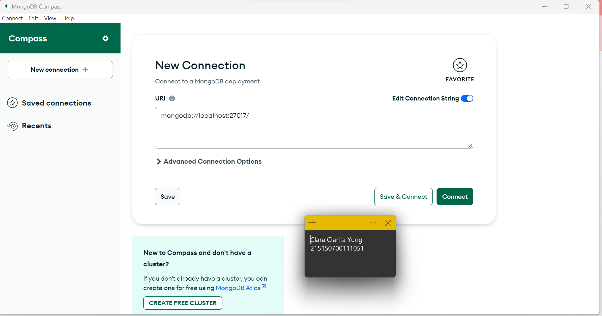

# Praktikum Modul 1 - Instalasi Lumen, MongoDB dan Konfigurasi APP Key

## 1. Menginstal PHP

PHP berhasil diinstal di perangkat dengan versi PHP 8.0.30

## 2. Menginstal Composer

Agar berhasil melakukan instalasi Composer, PHP harus sudah terinstal terlebih dahulu. Di gambar terlihat bahwa Composer sudah berhasil diinstal

## 3.Menginstal MongoDB

## 4. Menginstal Lumen
a. Direktori Lumen tersimpan
b. Lumen terinstal
c. Menjalankan server lumen

## 5. Konfigurasi APP_KEY

