# Praktikum Modul 2 - CRUD MongoDB Compass dan Shell

## MongoDB Compass
* ### Langkah 1
> Melakukan koneksi ke MongoDB Compass. Di sini saya tidak menggunakan atlas, sehingga koneksi yang dilakukan secara lokal

* ### Langkah 2
> Membuat database baru dengan nama "bookstore"

* ### Langkah 3
> Melakukan insert buku pertama dengan data seperti pada di gambar. Setelah klik "insert" maka data akan tersimpan di database

* ### Langkah 4
> Menambahkan 1 buku lagi dengan langkah yang sama dengan langkah 3

* ### Langkah 5
> Melakukan pencarian berdasarkan author menggunakan fitur "filter"

* ### Langkah 6
> Mengubah isi "summary" pada buku No Longer Human menjadi seperti pada gambar, setelah itu disimpan

* ### Langkah 7
> Menghapus buku "I Am a Cat"

## MongoDB Shell
* ### Langkah 1
> Melakukan koneksi dan masuk ke terminal MongoDB Compass yang terletak di pojok kiri bawah, sehingga tampilan menjadi seperti berikut:
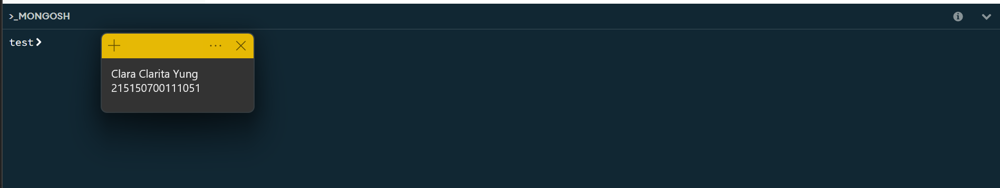

* ### Langkah 2
> Melihat list database yang terdapat di server
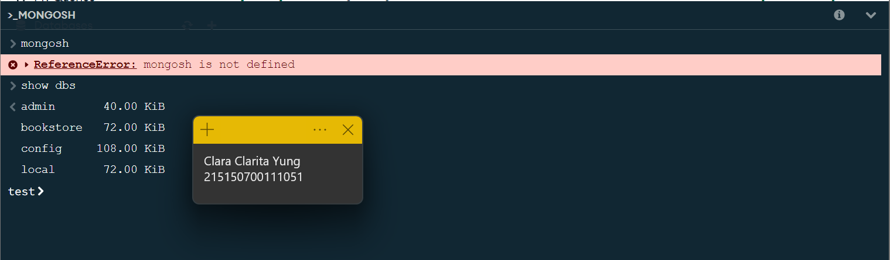

> Mencoba memindahkan database ke database "booksotre"
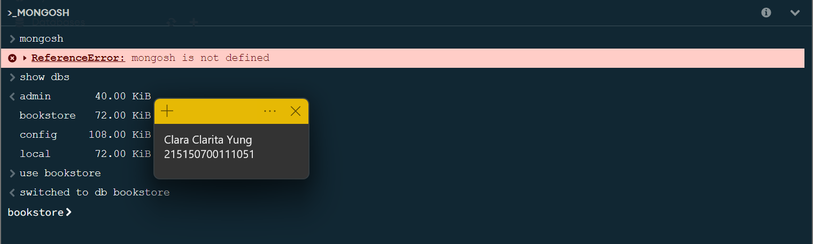

> Melihat collection yang ada pada database "bookstore"
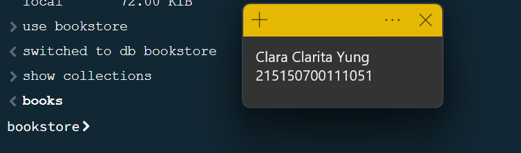

* ### Langkah 3
> Insert buku baru berjudul "Overlord I"
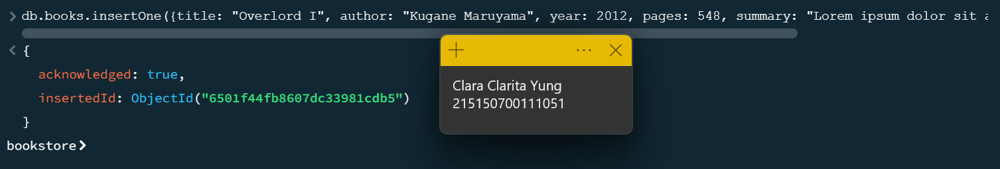

* ### Langkah 4
> Insert buku berjudul "The Setting Sun" dan "Hujan" menggunakan insert many
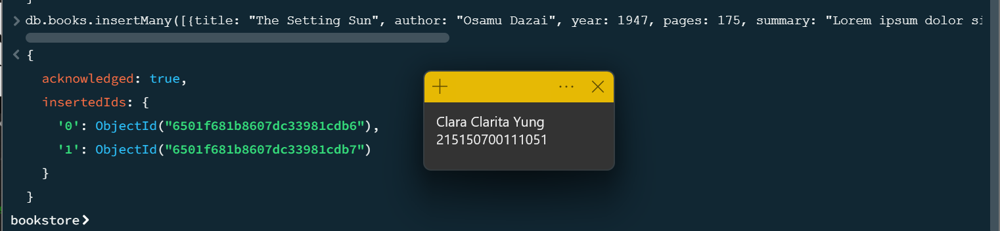

* ### Langkah 5
> Mencari semua buku
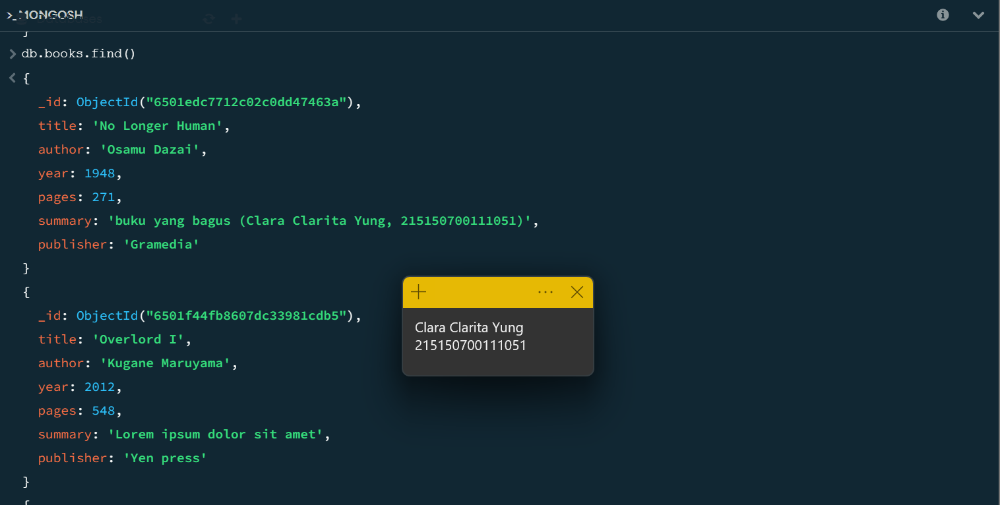

* ### Langkah 6
> Mencari buku dengan author "Osamu Dazai" dengan cara melakukan filter
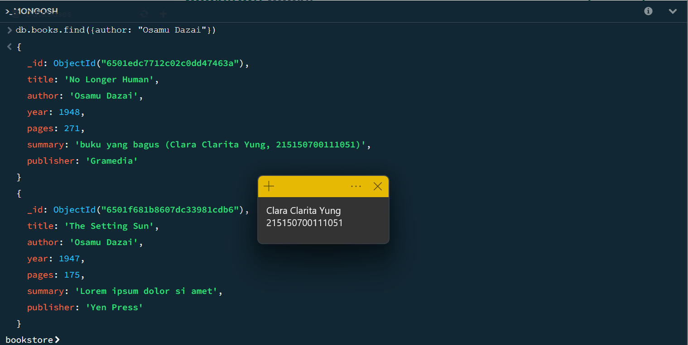

* ### Langkah 7
> Mengubah summary pada buku "Hujan"
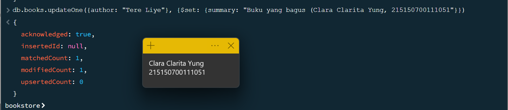

* ### Langkah 8
> Mengganti publisher pada buku author "Osamu Dazai" menjadi "Yen Press"

* ### Langkah 9
> Menghapus buku "Overlordd I"
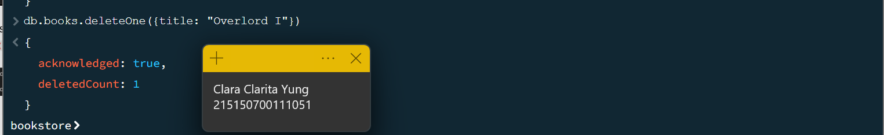

* ### Langkah 10
> Menghapus semua buku
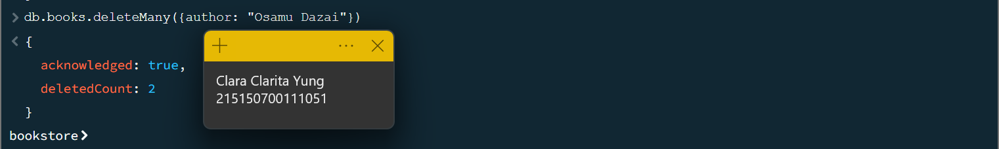
