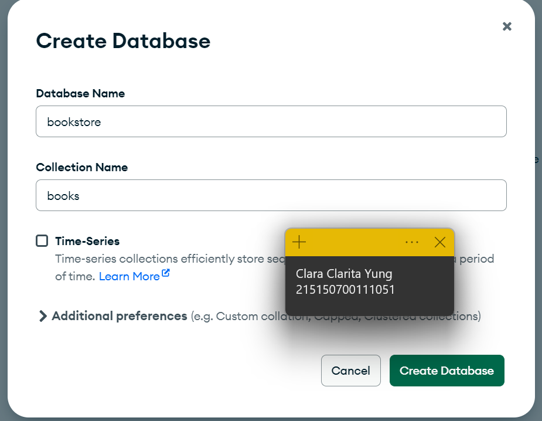
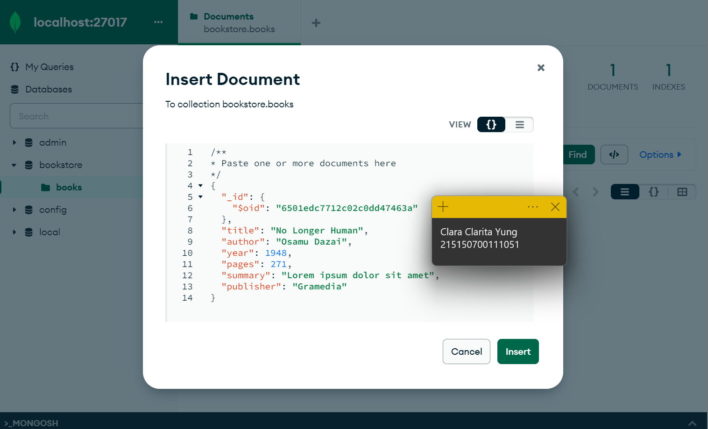
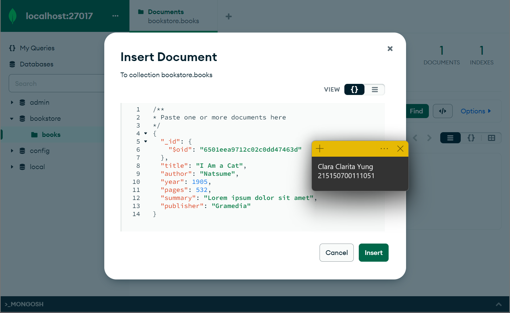
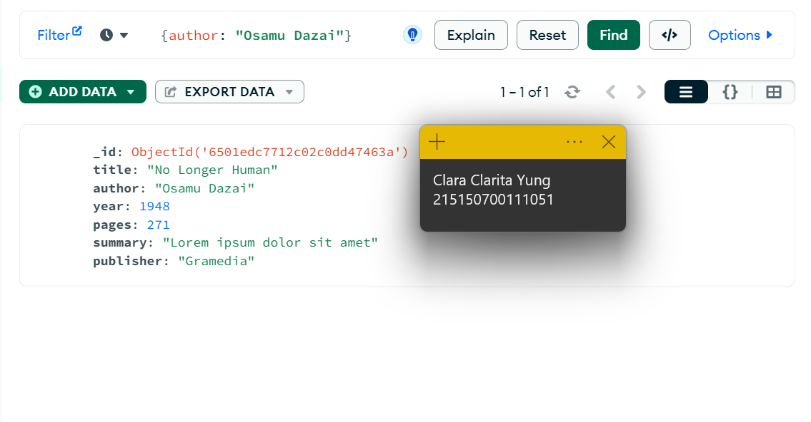
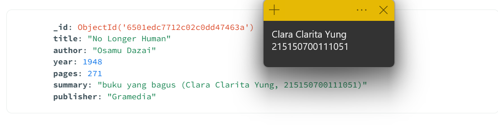
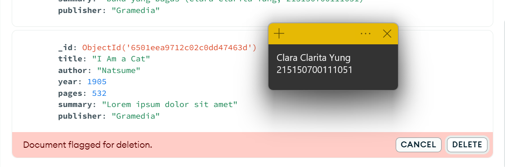

# Praktikum Modul 2 - CRUD MongoDB Compass dan Shell

## MongoDB Compass
### Langkah 1
Melakukan koneksi ke MongoDB Compass. Di sini saya tidak menggunakan atlas, sehingga koneksi yang dilakukan secara lokal

### Langkah 2
Membuat database baru dengan nama "bookstore"

### Langkah 3
Melakukan insert buku pertama dengan data seperti pada di gambar. Setelah klik "insert" maka data akan tersimpan di database

### Langkah 4
Menambahkan 1 buku lagi dengan langkah yang sama dengan langkah 3

### Langkah 5
Melakukan pencarian berdasarkan author menggunakan fitur "filter"

### Langkah 6
Mengubah isi "summary" pada buku No Longer Human menjadi seperti pada gambar, setelah itu disimpan

### Langkah 7
Menghapus buku "I Am a Cat"

## MongoDB Shell
### Langkah 1
### Langkah 2
### Langkah 3
### Langkah 4
### Langkah 5
### Langkah 6
### Langkah 7
### Langkah 8
### Langkah 9
### Langkah 10
