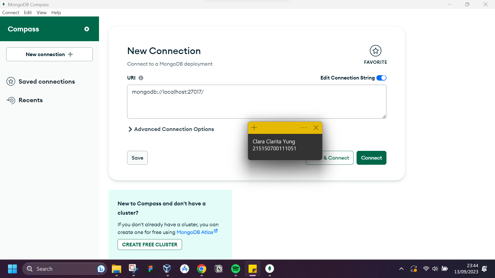

# Praktikum Modul 2 - Integrasi MongoDB dan Express

## Percobaan Instalasi NodeJs
* ### Langkah 1
> lorem ipsum

* ### Langkah 2
> lorem ipsum

* ### Langkah 3
> lorem ipsum

## Inisiasi project Express dan pemasangan package
* ### Langkah 1
> lorem ipsum

* ### Langkah 2
> lorem ipsum

* ### Langkah 3
> lorem ipsum

## Koneksi Express ke MongoDB
* ### Langkah 1
> lorem ipsum

* ### Langkah 2
> lorem ipsum

* ### Langkah 3
> lorem ipsum

* ### Langkah 4
> lorem ipsum

## Pembuatan Routing
* ### Langkah 1
> lorem ipsum

* ### Langkah 2
> lorem ipsum

* ### Langkah 3
> lorem ipsum

* ### Langkah 4
> lorem ipsum

* ### Langkah 5
> lorem ipsum

* ### Langkah 6
> lorem ipsum

## Pembuatan controller
* ### Langkah 1
> lorem ipsum

* ### Langkah 2
> lorem ipsum

* ### Langkah 3
> lorem ipsum

* ### Langkah 4
> lorem ipsum

* ### Langkah 5
> lorem ipsum

* ### Langkah 6
> lorem ipsum

* ### Langkah 7
> lorem ipsum

## Pembuatan Model
* ### Langkah 1
> lorem ipsum

* ### Langkah 2
> lorem ipsum

* ### Langkah 3
> lorem ipsum

## Operasi CRUD
* ### Langkah 1
> lorem ipsum

* ### Langkah 2
> lorem ipsum

* ### Langkah 3
> lorem ipsum

* ### Langkah 4
> lorem ipsum

* ### Langkah 5
> lorem ipsum

* ### Langkah 6
> lorem ipsum

* ### Langkah 7
> lorem ipsum

* ### Langkah 8
> lorem ipsum

* ### Langkah 9
> lorem ipsum

* ### Langkah 10
> lorem ipsum

* ### Langkah 11
> lorem ipsum

* ### Langkah 12
> lorem ipsum

