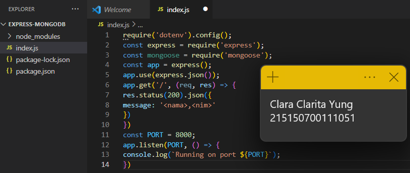
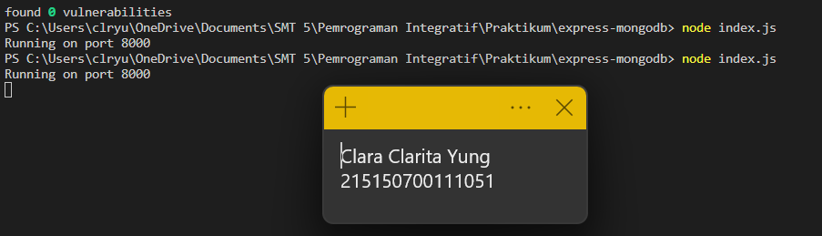
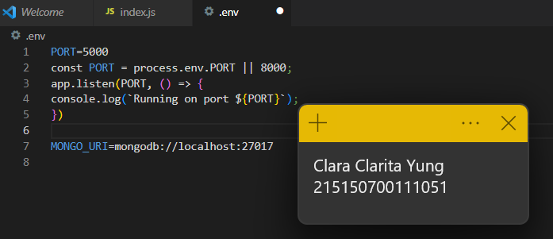
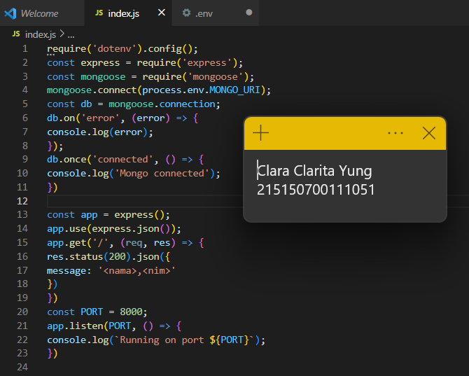
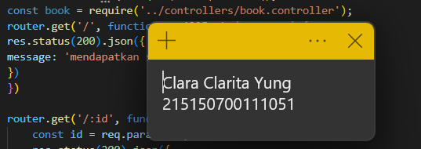
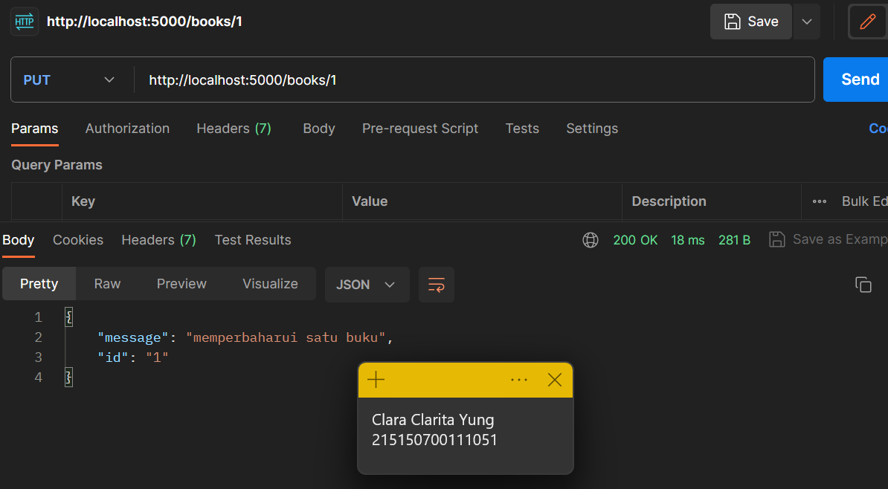
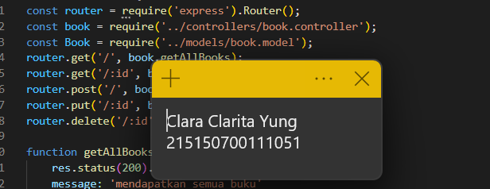
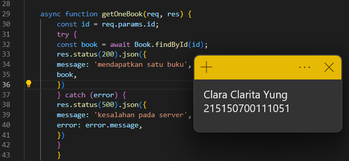
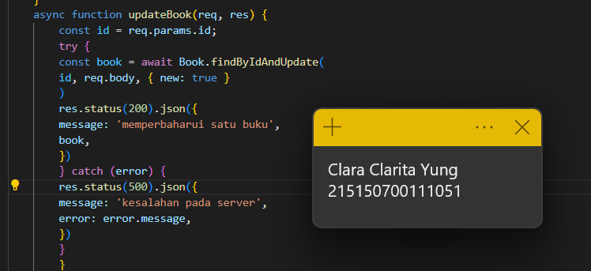

# Praktikum Modul 3 - Integrasi MongoDB dan Express

## Percobaan Instalasi NodeJs
* ### Langkah 1
> Mengunjungi halaman https://nodejs.org/en/

* ### Langkah 2
> Download dan instal NodeJS, di sini saya menggunakan versi 20.7.0

* ### Langkah 3
> Instalasi berhasil dan melakukan pengecekan versi

## Inisiasi project Express dan pemasangan package
* ### Langkah 1
> Membuat folder express-mongodb

* ### Langkah 2
> Melakukan npm init untuk mengenerate file package.json

* ### Langkah 3
> Menginstal express, mongoose, dan dotenv

## Koneksi Express ke MongoDB
* ### Langkah 1
> Membuat file index.js

> Lalu menjalankan server node

* ### Langkah 2
> Membuka file .env dan menambahkan kode seperti di gambar

* ### Langkah 3
> Menambahkan kode seperti di bawah pada file index.js

> Kemudian menjalankan aplikasi kembali

## Pembuatan Routing
* ### Langkah 1
> Membuat folder routes dan membuat file bernama book.route.js. Pada file tersebut membuat kode seperti yang ada di gambar

* ### Langkah 2
> Melakukan import book.route.js di file index.js

## Pembuatan controller
* ### Langkah 1
> Membuat folder controllers dan membuat file book.controller.js. Kemudian membuat kode seperti di bawah

* ### Langkah 2
> Melakukan pengujian di Postman

## Pembuatan Model
* ### Langkah 1
> Membuat folder models dan membuat file book.model.js. Kemudian menambahkan baris kode berikut:

## Operasi CRUD
* ### Langkah 1
> Menghapus data pada books colection

* ### Langkah 2
> Import book.model.js pada file book.controller.js, sehingga terdapat penambahan kode seperti di bawah:

* ### Langkah 3
> Mengubah fungsi create book

* ### Langkah 4
> Menambah daftar buku di Postman dengan data seperti di bawah:

* ### Langkah 5
> Melakukan perubahan pada fungsi getAllBooks

* ### Langkah 6
> Melakukan perubahan pada fungsi getOneBooks

* ### Langkah 7
> lorem ipsum

* ### Langkah 8
> lorem ipsum

* ### Langkah 9
> Melakukan perubahan pada fungsi updateBook

* ### Langkah 10
> lorem ipsum

* ### Langkah 11
> Melakukan perubahan pada fungsi deleteBook

* ### Langkah 12
> lorem ipsum

