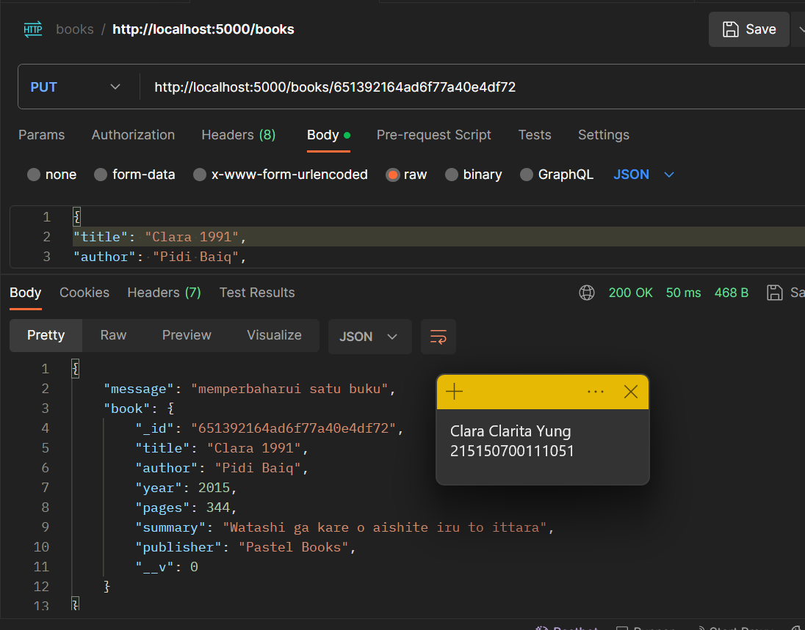

# Praktikum Modul 4 - Basic Routing & Migration

## Get
* ### Langkah 1
> Menambahkan kode berikut pada akhir baris di file web.php yang terletak di folder routes. Setelah disimpan, jalankan server PHP dengan perintah "php -S localhost:8000 -t public"

* ### Langkah 2
> Setelah server berjalan, buka URL http://localhost:8000/get. Maka browser akan menampilkan pesan "GET" seperti yang telah ditambahkan pada file web.php sebelumnya.

## POST, PUT, PATCH, DELETE, dan OPTIONS
* ### Langkah 1
> Menambahkan methode POST, PUT, PATCH, DELETE, dan OPTIONS di file web.php

* ### Langkah 2
> Menginstal ekstensi Thunder Client di VSCode. Setelah diinstal, melakukan request ke URL berdasarkan methodenya

## Migrasi Database
* ### Langkah 1
> Membuat file index.js

> Lalu menjalankan server node

* ### Langkah 2
> Membuka file .env dan menambahkan kode seperti di gambar

* ### Langkah 3
> Menambahkan kode seperti di bawah pada file index.js

> Kemudian menjalankan aplikasi kembali

## Pembuatan Routing
* ### Langkah 1
> Membuat folder routes dan membuat file bernama book.route.js. Pada file tersebut membuat kode seperti yang ada di gambar

* ### Langkah 2
> Melakukan import book.route.js di file index.js

## Pembuatan controller
* ### Langkah 1
> Membuat folder controllers dan membuat file book.controller.js. Kemudian membuat kode seperti di bawah

* ### Langkah 2
> Melakukan pengujian di Postman

## Pembuatan Model
* ### Langkah 1
> Membuat folder models dan membuat file book.model.js. Kemudian menambahkan baris kode berikut:

## Operasi CRUD
* ### Langkah 1
> Menghapus data pada books colection

* ### Langkah 2
> Import book.model.js pada file book.controller.js, sehingga terdapat penambahan kode seperti di bawah:

* ### Langkah 3
> Mengubah fungsi create book

* ### Langkah 4
> Menambah daftar buku di Postman dengan data seperti di bawah:

* ### Langkah 5
> Melakukan perubahan pada fungsi getAllBooks

* ### Langkah 6
> Melakukan perubahan pada fungsi getOneBooks

* ### Langkah 7
> Menampilkan semua buku yang telah ditambahkan sebelumnya

* ### Langkah 8
> Menampilkan buku Dilan 1990 dengan id "6513917e4ad6f77a40e4df70"

* ### Langkah 9
> Melakukan perubahan pada fungsi updateBook

* ### Langkah 10
> Mengubah judul buku DIlan 1991 dengan ID "651392164ad6f77a40e4df72" menjadi nama panggilan

* ### Langkah 11
> Melakukan perubahan pada fungsi deleteBook

* ### Langkah 12
> Menghapus buku Dilan 1990 dengan DELETE di Postman

