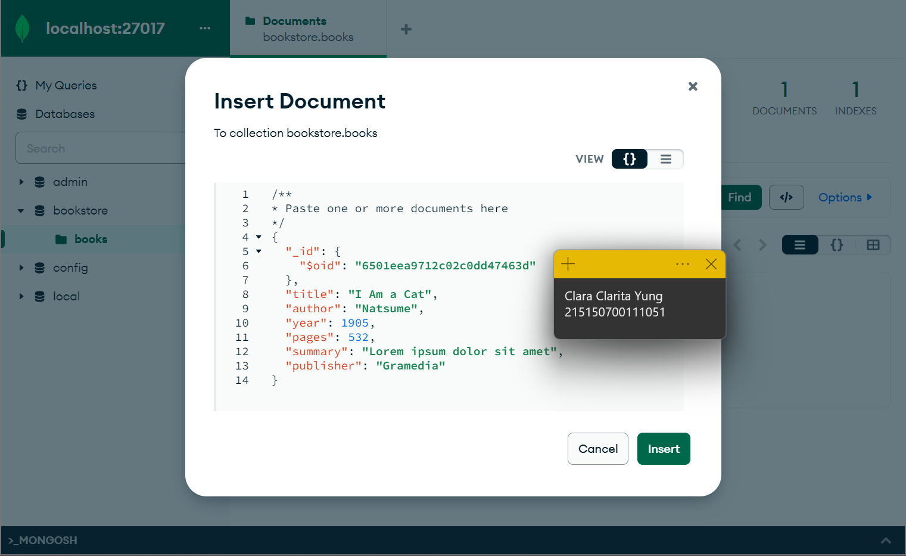

# Praktikum Modul 5 - Dynamic Route dan Middleware

* ### Dynamic Route
> Menambahkan dynamic route di file web.php

* ### Aliases Route
> Membuat database baru dengan nama "bookstore"

* ### Group Route
> Melakukan insert buku pertama dengan data seperti pada di gambar. Setelah klik "insert" maka data akan tersimpan di database

* ### Middleware
> Menambahkan 1 buku lagi dengan langkah yang sama dengan langkah 3

