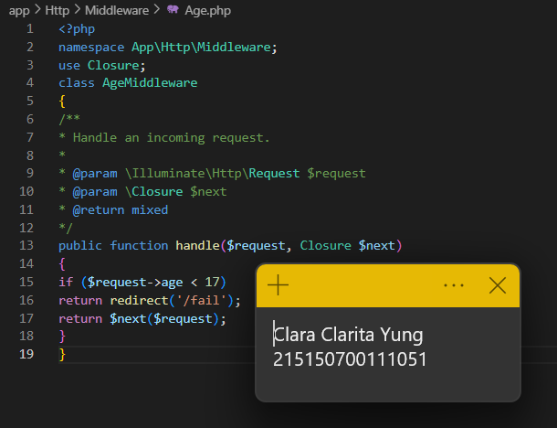

# Praktikum Modul 5 - Dynamic Route dan Middleware

* ### Dynamic Route
> Menambahkan dynamic route di file web.php

> Berikut adalah hasilnya

* ### Aliases Route
> Menambahkan aliases route

* ### Group Route
> Membuat grouping pada router

* ### Middleware
> Membuka file middleware

> Menyalin file ExampleMiddleware.php dan memberi nama "AgeMiddleware.php"

> Mendaftarkan middleware Age pada file app.php

> Menambahkan middleware pada route

> Menambahkan middleware pada routes

> Mengakses "localhost:8000/admin/home" sehingga akan muncul pesan berikut

