# Praktikum Modul 6 - Model, Controller dan Request-Response Handler

## Model
* ### Langkah 1
Membuat model User.php menggunakan php artisan make:model User. Setelah model dibuat, hapus kode sebelumnya dan ganti menjadi seperti berikut:

## Controller
* ### Langkah 1
Membuat salinan ExampleController.php dan memberi nama salinan HomeController.php. Pada HomeController.php dibuat fungsi index() seperti berikut:
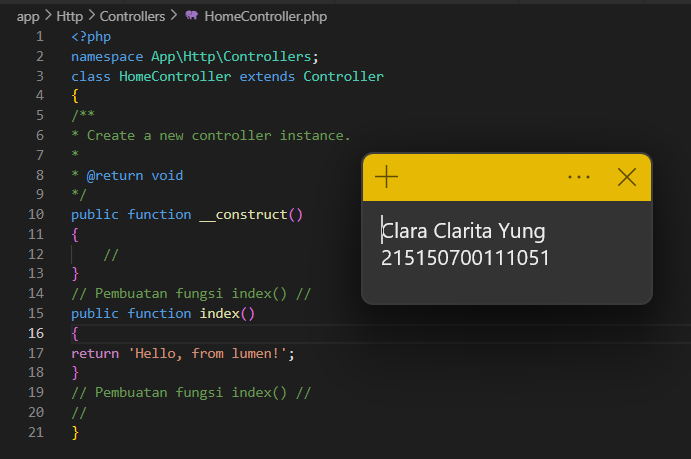
* ### Langkah 2
Mengubah route pada file web.php sehingga menjadi seperti berikut:
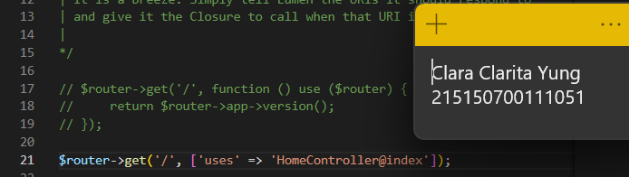
* ### Langkah 3
Menjalankan aplikasi dengan php -S localhost:8000 -t public. Saat aplikasi dijalankan, maka web browser akan mengeluarkan pesan berikut
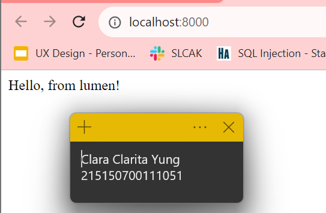

## Request Handler
* ### Langkah 1
Melakukan import library Request dan melakukan perubahan fungsi index() pada HomeController.php
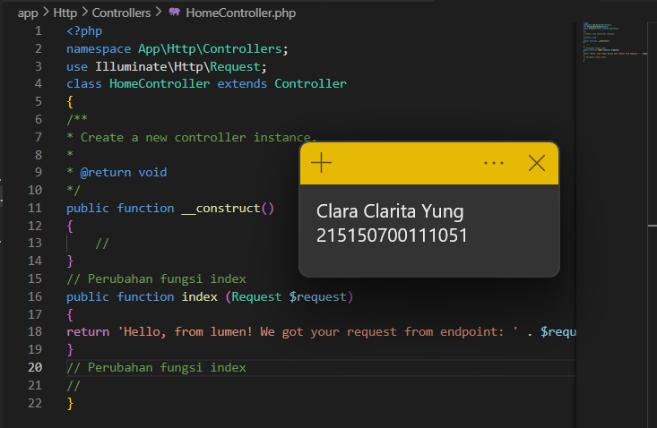
* ### Langkah 2
Menjalankan aplikasi
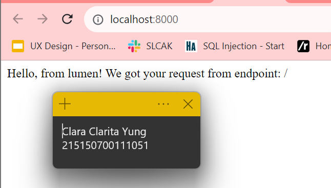

## Response Handler
* ### Langkah 1
Melakukan import library Response di HomeController.php
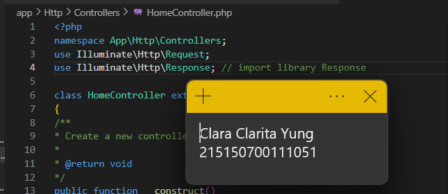
* ### Langkah 2
Membuat fungsi Hello(), sehingga keseluruhan code menjadi seperti berikut:
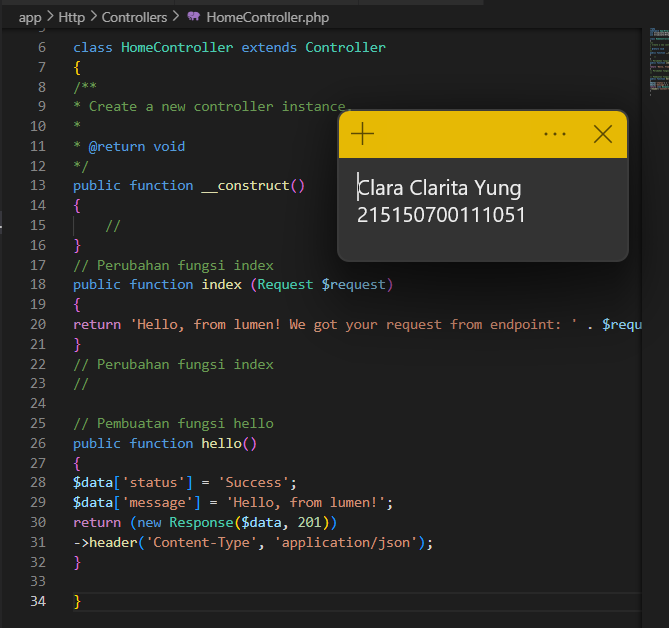
* ### Langkah 3
Menambahkan route hello pada web.php
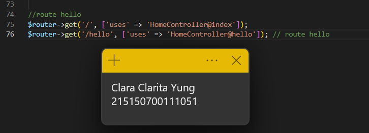
* ### Langkah 4
Menjalankan aplikasi pada route hello
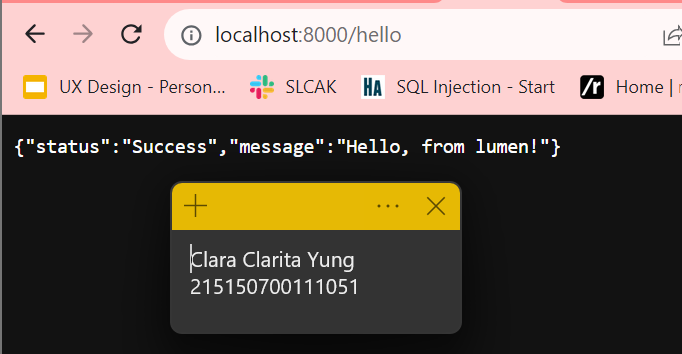

## Penerapan
* ### Langkah 1
Melakukan import Model Users pada bagian atas HomeController.php
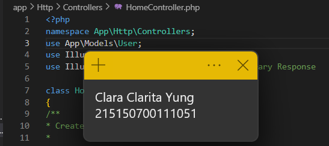
* ### Langkah 2
Menambahkan 3 fungsi baru di HomeController.php
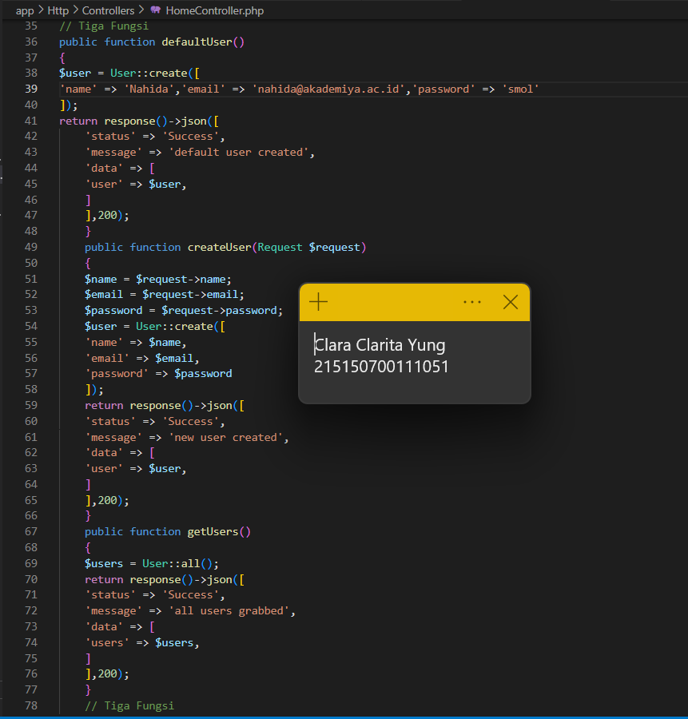
* ### Langkah 3
Menambahkan 3 route baru di web.php
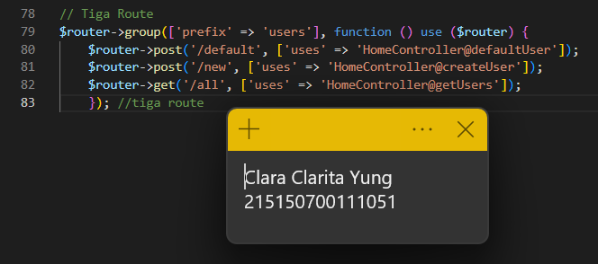
* ### Langkah 4
Menjalankan aplikasi melalui postman
route users/default (POST)
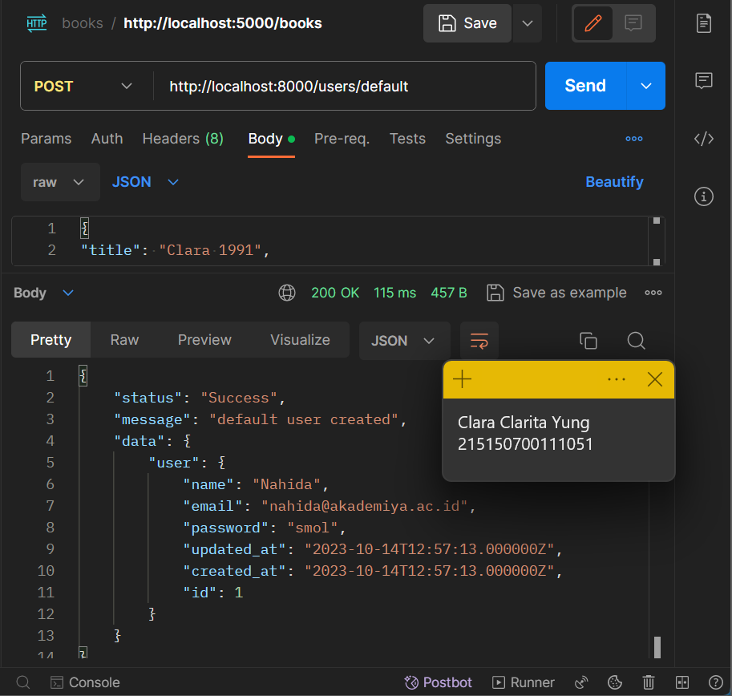

route users/all (GET)
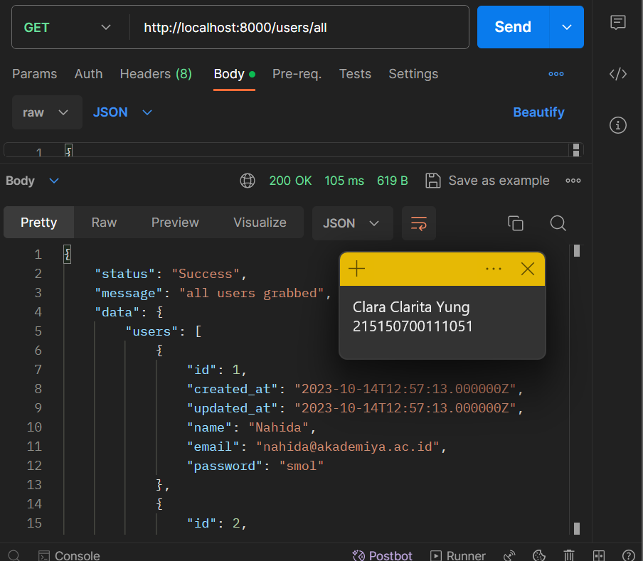

