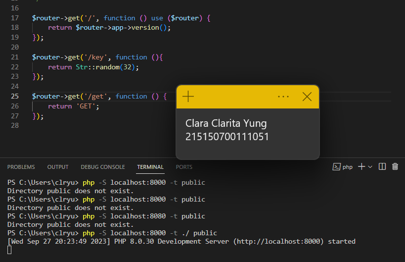
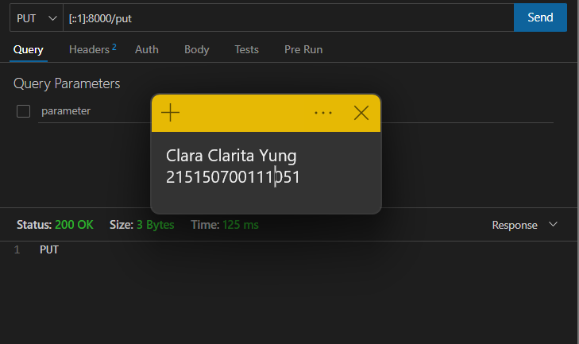
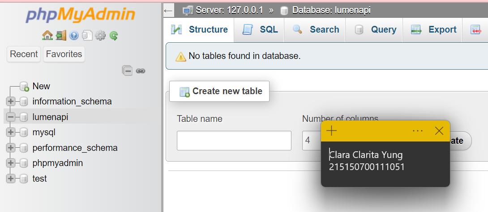
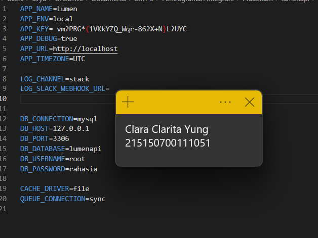
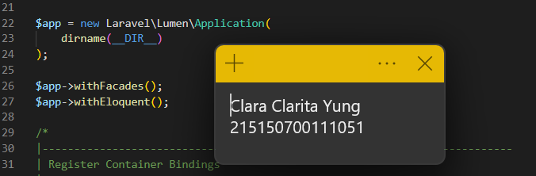

# Praktikum Modul 6 - Model, Controller dan Request-Response Handler

## Model
* ### Langkah 1
> Menambahkan kode berikut pada akhir baris di file web.php yang terletak di folder routes. Setelah disimpan, jalankan server PHP dengan perintah "php -S localhost:8000 -t public"

* ### Langkah 2
> Setelah server berjalan, buka URL http://localhost:8000/get. Maka browser akan menampilkan pesan "GET" seperti yang telah ditambahkan pada file web.php sebelumnya.

## Controller
* ### Langkah 1
> Menambahkan methode POST, PUT, PATCH, DELETE, dan OPTIONS di file web.php

* ### Langkah 2
> Menginstal ekstensi Thunder Client di VSCode. Setelah diinstal, melakukan request ke URL berdasarkan methodenya

## Request Handler
* ### Langkah 1
> Membuat database lumenapi

> Mengubah konfigurasi database pada file .env

* ### Langkah 2
> Menghapus komen baris berikut di file app.php sehingga kode aktif, seperti di gambar

* ### Langkah 3
> Menjalankan perintah berikut di terminal

> Sehingga dihasilkan file berikut

## Response Handler
* ### Langkah 1
> Membuat database lumenapi

> Mengubah konfigurasi database pada file .env

## Penerapan
* ### Langkah 1
> Membuat database lumenapi

> Mengubah konfigurasi database pada file .env
