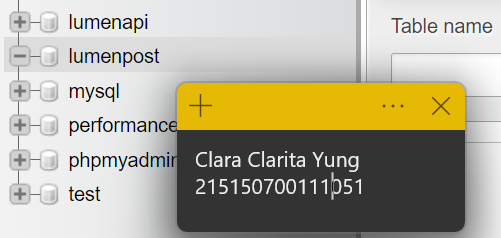
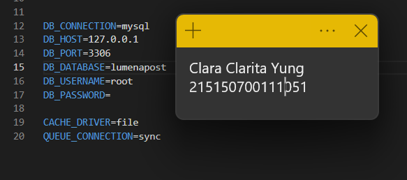
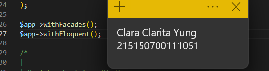
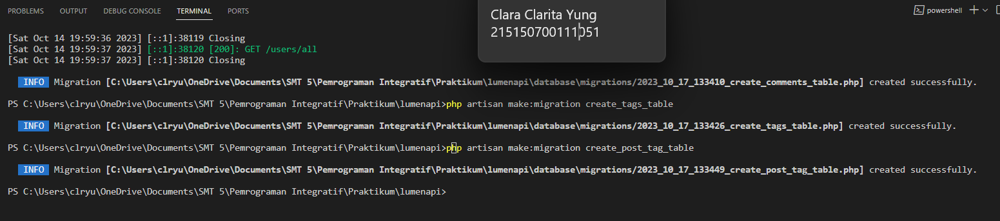
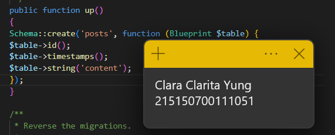
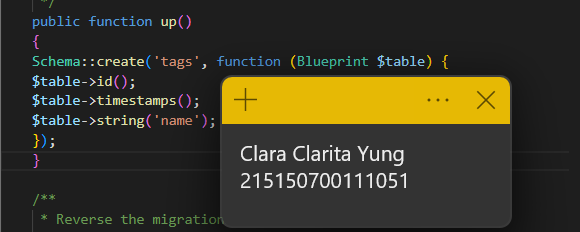
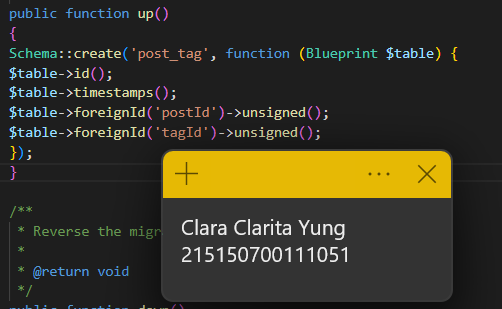
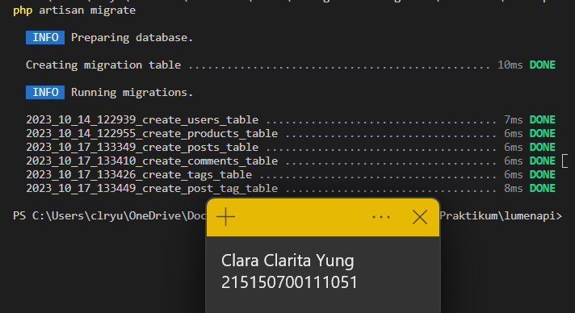
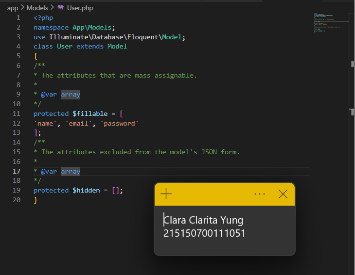

# Praktikum Modul 7 - Relasi One-to-Many dan Many-to-Many

## Pembuatan Tabel
* ### Langkah 1
Mengaktifkan server database (XAMPP) dan membuat database baru bernama lumenpost

* ### Langkah 2
Mengubah konfigurasi database di .env sehingga database menjadi lumenpost

* ### Langkah 3
Mengaktifkan beberapa library di file app.php

* ### Langkah 4
Membuat file migration dengan command php artisan make:migration untuk membuat tabel posts, comments, tags, dan post comment 

* ### Langkah 5
Mengubah fungsi up() di migrasi create_posts_table

* ### Langkah 6
Mengubah fungsi up() di migrasi create_comments_table

* ### Langkah 7
Mengubah fungsi up() di migrasi create_tags_table

* ### Langkah 8
Mengubah fungsi up() di migrasi create_post_tag_table

* ### Langkah 9
Menjalankan command php artisan migrate

## Pembuatan Model
* ### Langkah 1
Lorem ipsum

* ### Langkah 2
Lorem ipsum

* ### Langkah 3
Lorem ipsum

## Relasi one to many
* ### Langkah 1
Lorem ipsum

* ### Langkah 2
Lorem ipsum

* ### Langkah 3
Lorem ipsum

* ### Langkah 4
Lorem ipsum

* ### Langkah 5
Lorem ipsum

* ### Langkah 6
Lorem ipsum

* ### Langkah 7
Lorem ipsum

* ### Langkah 8
Lorem ipsum

## Relasi many to many
* ### Langkah 1
Lorem ipsum

* ### Langkah 2
Lorem ipsum

* ### Langkah 3
Lorem ipsum

* ### Langkah 4
Lorem ipsum

* ### Langkah 5
Lorem ipsum

* ### Langkah 6
Lorem ipsum

* ### Langkah 7
Lorem ipsum

* ### Langkah 8
Lorem ipsum

* ### Langkah 9
Lorem ipsum

* ### Langkah 10
Lorem ipsum

* ### Langkah 11
Lorem ipsum

* ### Langkah 12
Lorem ipsum

* ### Langkah 13
Lorem ipsum

* ### Langkah 14
Lorem ipsum

