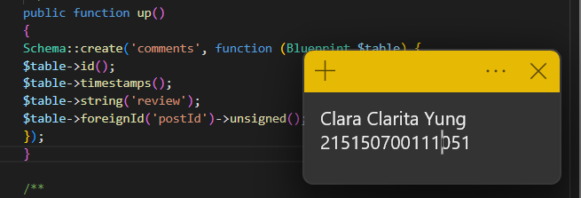
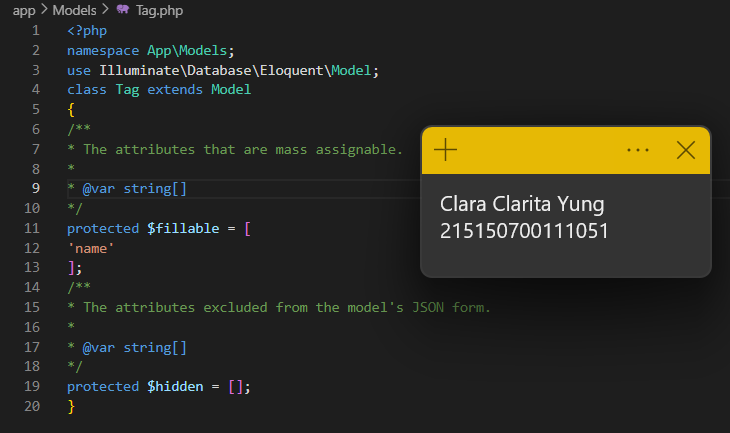
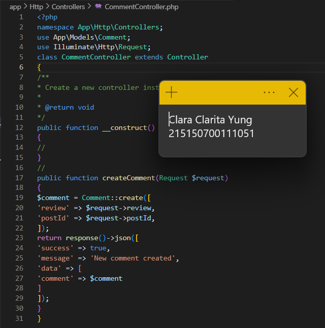

# Praktikum Modul 7 - Relasi One-to-Many dan Many-to-Many

## Pembuatan Tabel
* ### Langkah 1
Mengaktifkan server database (XAMPP) dan membuat database baru bernama lumenpost

* ### Langkah 2
Mengubah konfigurasi database di .env sehingga database menjadi lumenpost

* ### Langkah 3
Mengaktifkan beberapa library di file app.php

* ### Langkah 4
Membuat file migration dengan command php artisan make:migration untuk membuat tabel posts, comments, tags, dan post comment 

* ### Langkah 5
Mengubah fungsi up() di migrasi create_posts_table

* ### Langkah 6
Mengubah fungsi up() di migrasi create_comments_table

* ### Langkah 7
Mengubah fungsi up() di migrasi create_tags_table

* ### Langkah 8
Mengubah fungsi up() di migrasi create_post_tag_table

* ### Langkah 9
Menjalankan command php artisan migrate

Ini tampilan di phpMyAdmin

## Pembuatan Model
* ### Langkah 1
Membuat file di folder model dengan nama Post.php

* ### Langkah 2
Membuat file di folder model dengan nama Comment.php

* ### Langkah 3
Membuat file di folder model dengan nama Tag.php

## Relasi one to many
* ### Langkah 1
Menambahkan fungsi comment() di file Post.php

* ### Langkah 2
Menambhakan fungsi post() dan atribut postId pada fillable di file Post.php

* ### Langkah 3
Membuat file PostController.php di folder controller

* ### Langkah 4
Membuat file CommentController.php di folder controller

* ### Langkah 5
Menambahkan route baru di web.php

* ### Langkah 6
Mengisi value dari content dengan "disana engkau berdua" dan melakukan post di postman

* ### Langkah 7
Membuat komen dan melakukan post di route /comments

* ### Langkah 8
Menampilkan post dengan id 1 di postman

## Relasi many to many
* ### Langkah 1
Menambahkan fungsi tags() di Post.php

* ### Langkah 2
Menambahkan fungsi posts() di Tag.php

* ### Langkah 3
Membuat file TagController.php

* ### Langkah 4
Lorem ipsum

* ### Langkah 5
Lorem ipsum

* ### Langkah 6
Lorem ipsum

* ### Langkah 7
Lorem ipsum

* ### Langkah 8
Lorem ipsum

* ### Langkah 9
Lorem ipsum

* ### Langkah 10
Lorem ipsum

* ### Langkah 11
Lorem ipsum

* ### Langkah 12
Lorem ipsum

* ### Langkah 13
Lorem ipsum

* ### Langkah 14
Lorem ipsum

