# Praktikum Modul 8 - Register, Authentication dan Authorization

## Register
* ### Langkah 1
Membuat file AuthController.php di folder Controller
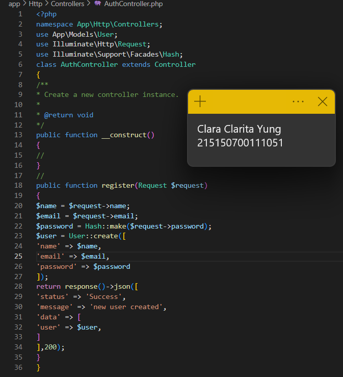
* ### Langkah 2
Menambahkan route baru di web.php 
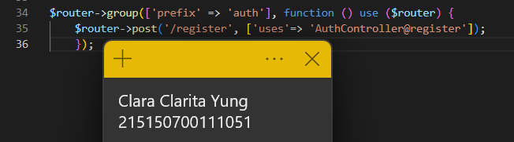
* ### Langkah 3
Menjalankan di postman dengan body seperti di gambar
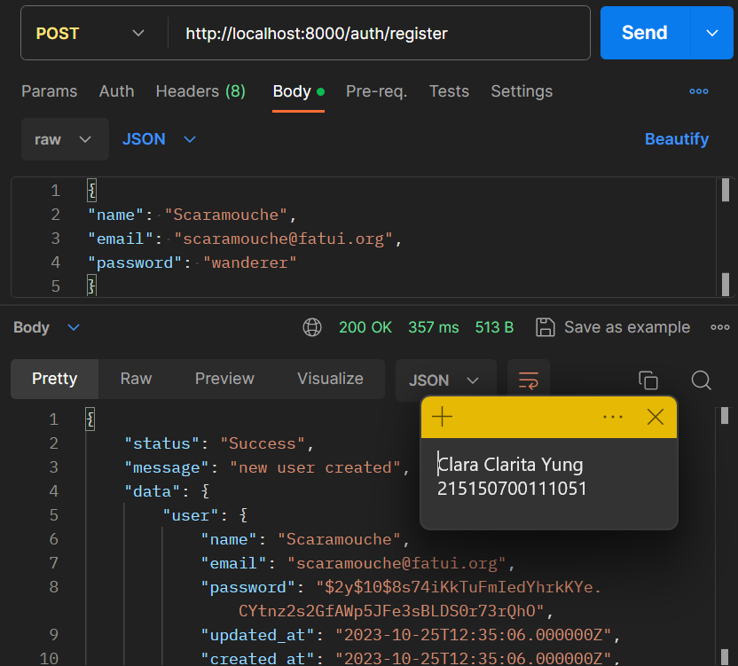

## Authentication
* ### Langkah 1
Menambahkan fungsi login di AuthController.php
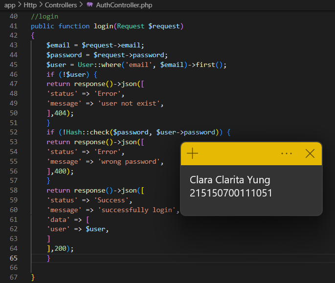
* ### Langkah 2
Menambahkan route baru di web.php
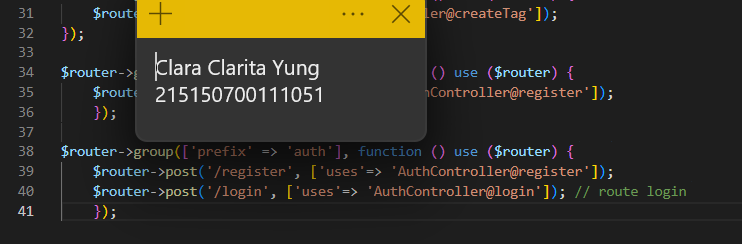
* ### Langkah 3
Menjalankan di Postman dengan body seperti di gambar
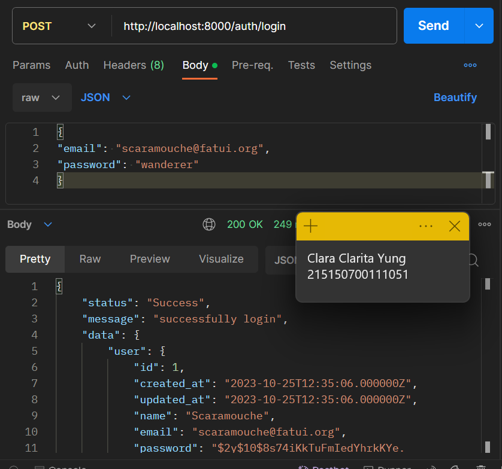
Berikut jika password salah
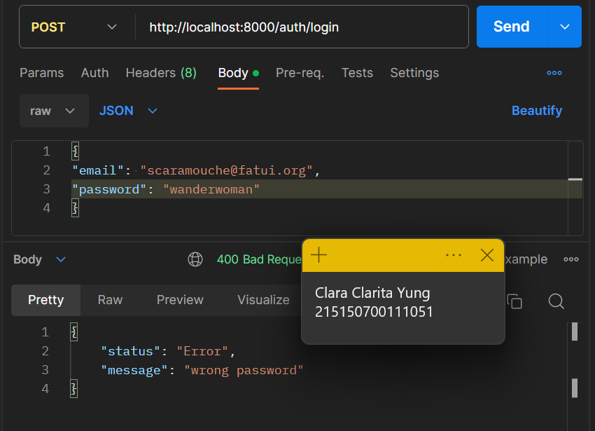

## Token
* ### Langkah 1
Membuat file migrasi baru
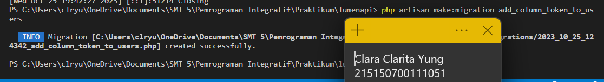
* ### Langkah 2
Menambahkan kode berikut di migrasi yang baru dibuat
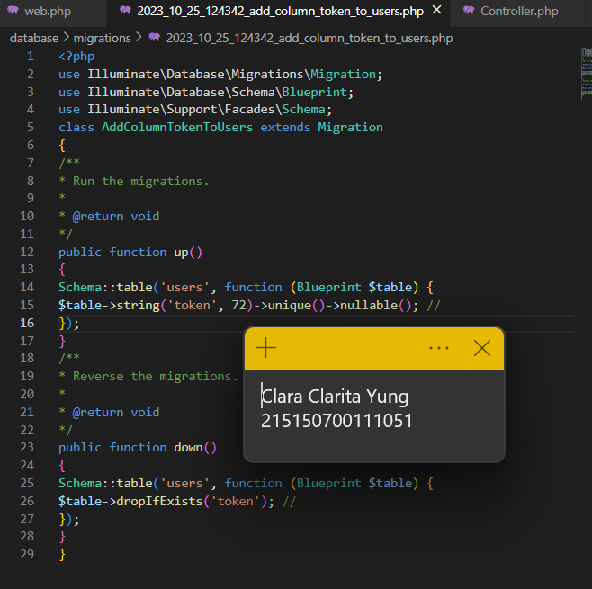
* ### Langkah 3
Menambahkan atribut token di $fillable, sehingga kode menjadi seperti berikut
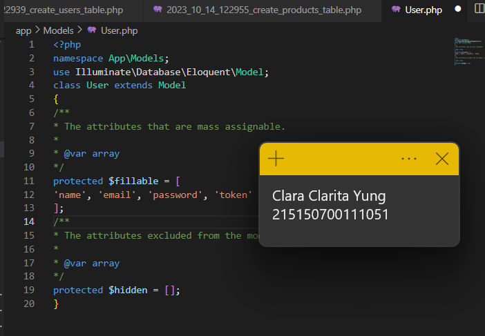
* ### Langkah 4
Menambahkan "$user->token = Str::random(36);" dan "$user->save()" di fungsi login pada AuthController seperti gambar berikut. Sebelumnya perlu mengimpor Str terlebih dahulu
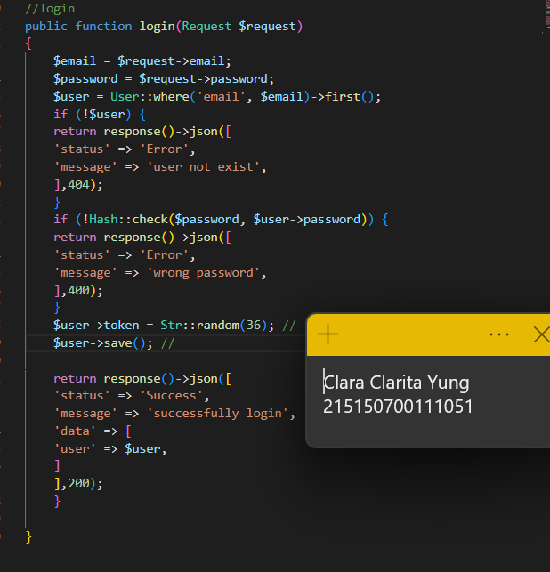
impor Str
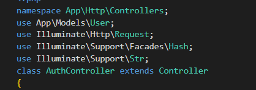
* ### Langkah 5
Menjalankan php artisan migrate
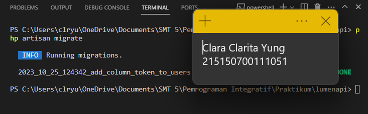
* ### Langkah 6
Menjalankan di Postman, terlihat token sudah muncul
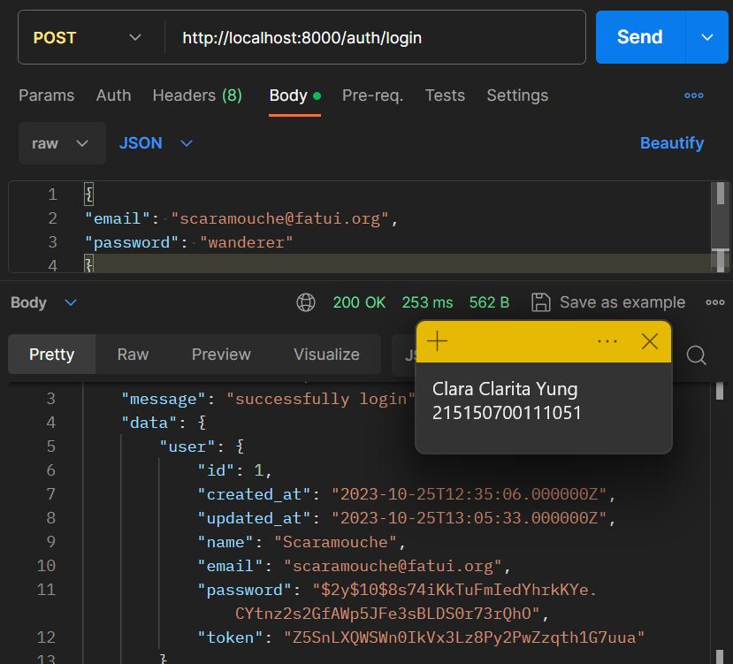

## Authorization
* ### Langkah 1
Membuat file Authorization.php di folder Middleware
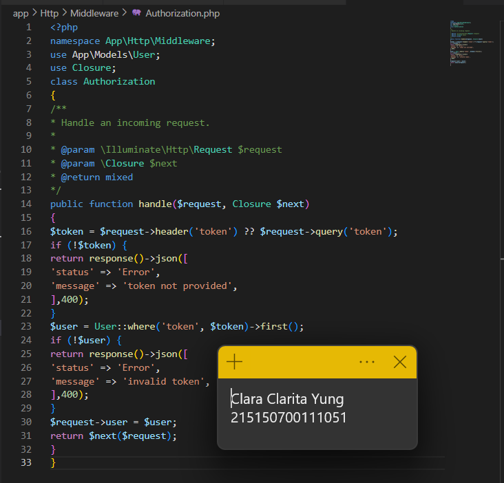
* ### Langkah 2
Menambahkan middleware baru
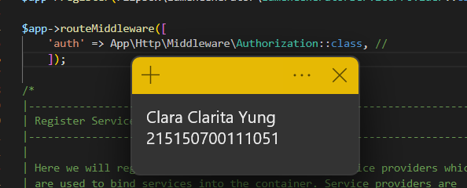
* ### Langkah 3
Menambahkan fungsi home di file HomeController.php
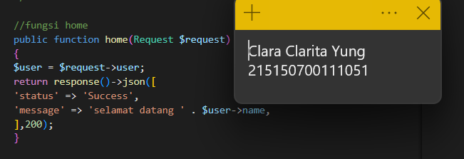
* ### Langkah 4
Menambahkan route baru di web.php
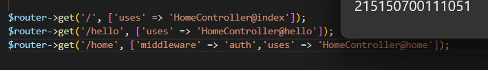
* ### Langkah 5
Menjalankan aplikasi di Postman dengan memasukkan token yang sudah didapatkan sebelumnya
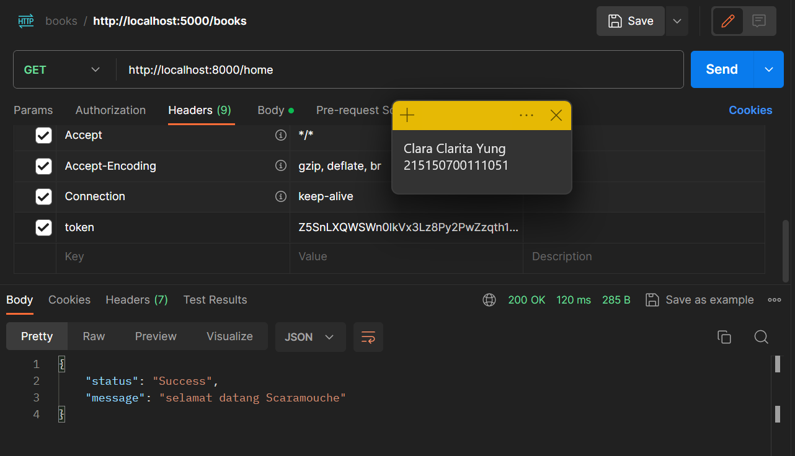

