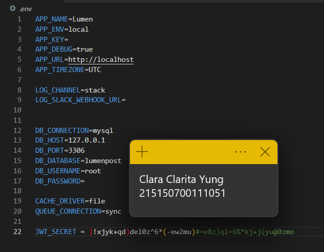

# Praktikum Modul 8 - JSON Web Token

## Penyesuaian Database
* ### Langkah 1
Menghapus parameter 72 di function up() pada file migrasi AddToken, sehingga function menjadi seperti ini:

* ### Langkah 2
Memperbarui migrasi sebelumnya

* ### Langkah 3
Menjalankan di postman dengan body seperti di gambar

## JWT Manual
* ### Langkah 1
Menambahkan 3 fungsi baru pada AuthController.php

* ### Langkah 2
Mengubah fungsi login

* ### Langkah 3
Menambahkan 4 fungsi baru di file Authorization.php

* ### Langkah 4
Mengubah fungsi handle di file Authorization.php

* ### Langkah 5
Menjalankan di Postman dengan body seperti berikut

Dan hasilnya seperti ini

Terdapat informasi token, lalu token disalin ke notepad
* ### Langkah 6
Jalankan aplikasi pada endpoint /home dengan melampirkan nilai token yang didapat setelah login pada header

## JWT Library
* ### Langkah 1
Generate secret key di website Dejcrety

Memasukkan secret key yang didapatkan ke file .env

* ### Langkah 2
Menginstal package jwt firebase

* ### Langkah 3
Menambahkan fungsi baru di AuthContrller.php

* ### Langkah 4
Mengubah fungsi login dan menghapus 3 fungsi sebelumnya

* ### Langkah 5
Membuat file middleware bernama JwtMiddleware.php

* ### Langkah 6
Mendaftarkan middleware di app.php

* ### Langkah 7
Menambahkan doute baru di web.php

* ### Langkah 8
Menjalankan di Postman dengan body sebagai berikut

Terlihat hasil dan token sebagai berikut

* ### Langkah 9
Menjalankan aplikasi di /home dengan memasukkan token yang sudah didapatkan sebelumnya

